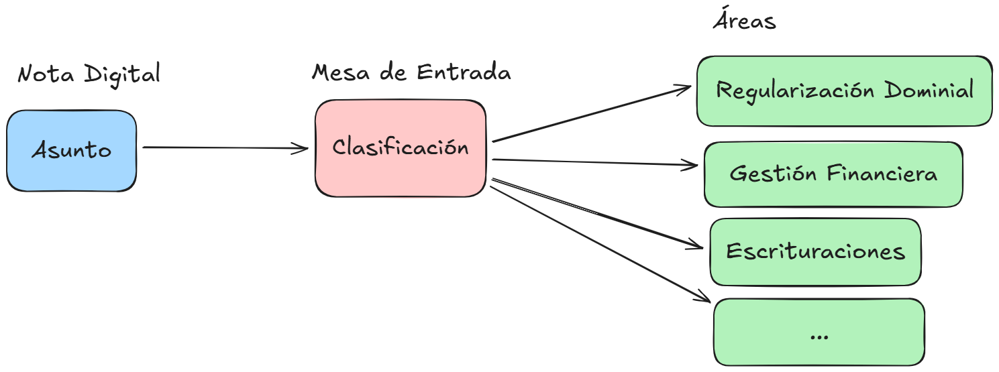
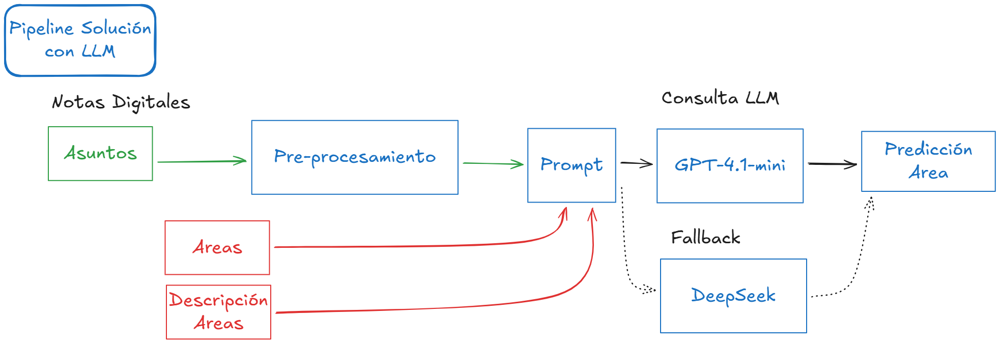

# dpv-areas

**Clasificación automática de trámites digitales mediante Inteligencia Artificial**

Sistema de clasificación automática de notas digitales a partir del campo **Asunto**, con el objetivo de derivar cada trámite al área correspondiente.

El sistema se aplica al proceso de ingreso de trámites en la **Mesa de Entradas (SUAC)** de la Dirección de Vivienda de la Provincia de Córdoba.


*Esquema general Mesa de Entrada.*

---

## Objetivo

Clasificar automáticamente los asuntos de notas digitales y asignarlos al área administrativa correspondiente, reduciendo errores de derivación y tiempos de procesamiento manual.

---

### Pipeline de la solución propuesta

El proyecto implementa un pipeline de inferencia basado en un modelo de lenguaje, respaldado por un conjunto de experimentos comparativos documentados.



*Pipeline de inferencia basado en modelos de lenguaje para la clasificación automática de trámites.*

---

## Estructura del repositorio

```text
dpv-areas/
├── app/            # Código productivo del pipeline de inferencia
├── experiments/    # Notebooks de experimentación
├── results/        # Resultados de los experimentos
├── data/           # Descripción de datos (no versionados)
├── docs/           # Documentación técnica y metodológica
├── pyproject.toml  # Definición del proyecto y dependencias
└── README.md
```

## Uso básico

### Instalación del entorno

El proyecto utiliza **uv** para la gestión del entorno y las dependencias.

```bash
uv sync
```
Este comando crea el entorno virtual e instala todas las dependencias definidas en `pyproject.toml`.

### Configuración

Crear el archivo `.env` a partir del ejemplo:

```bash
cp .env.example .env
```

y definir las claves de API correspondientes.

### Ejecución de ejemplo

```bash
uv run python -m app.dpv_areas.cli --asunto "CAMBIO DE TITULARIDAD PARA ADJUDICATARIOS"
```

El comando devuelve el área asignada al asunto.

## Documentación

La documentación técnica y metodológica del proyecto se encuentra en el directorio `docs/`, donde se detalla la arquitectura del sistema.

## Estado del proyecto

Versión actual: **v0**

Pipeline funcional, experimentos documentados y resultados agregados.

